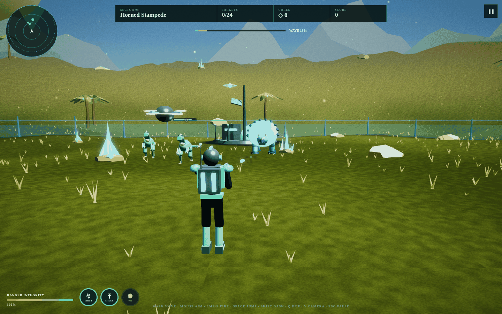
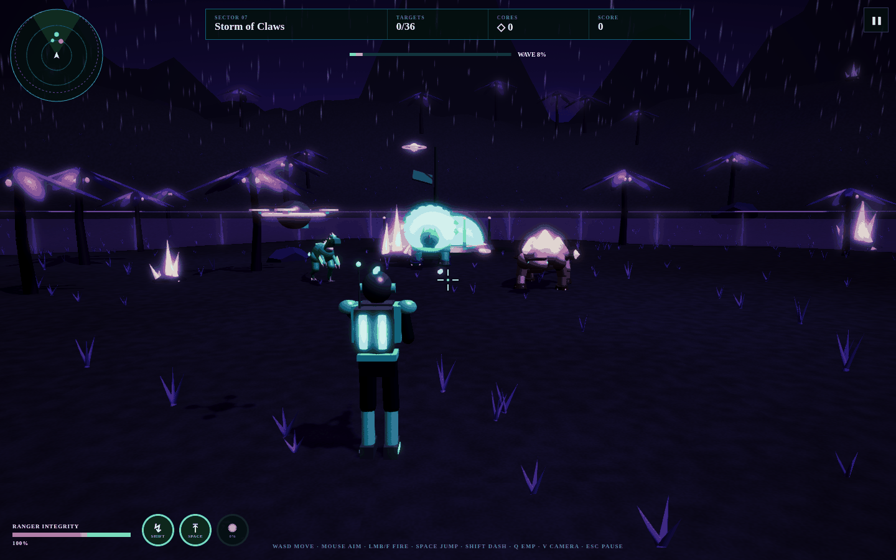
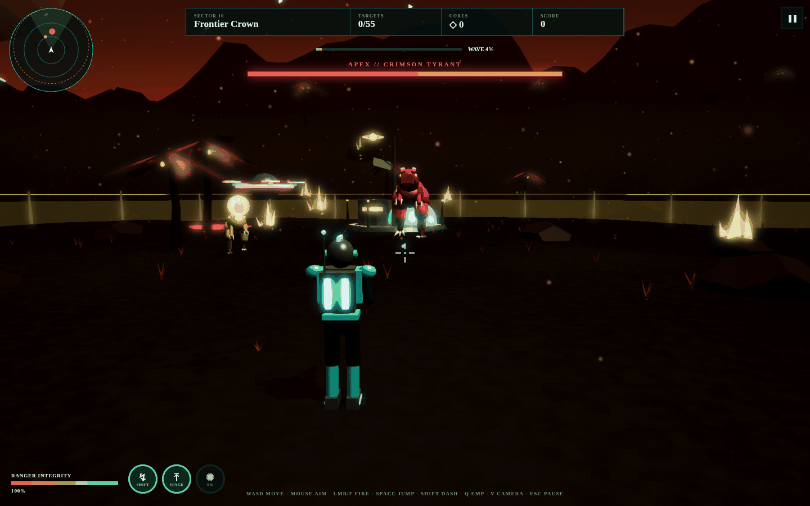
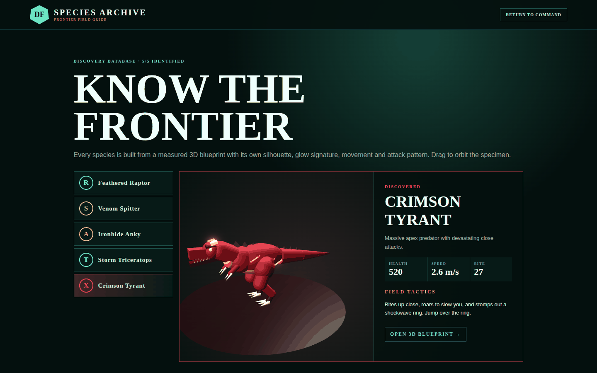

# Dino Frontier Survival 2.0 — full 3D

Track. Defend. Evolve. A third-person 3D dinosaur survival shooter built with Babylon.js on vinext, served at
`frontier.flexzonicgames.com`. Every ranger, dinosaur, structure and prop is generated from measured
[3D blueprints](docs/BLUEPRINTS.md), and the game ships its own interactive blueprint archive at `/blueprints`.



| Thunder Canopy storm | Apex Caldera boss fight |
| --- | --- |
|  |  |
| **Crimson Tyrant blueprint sheet** | **3D field guide** |
|  |  |

## What's in 2.0

- **Third-person 3D camera** with over-the-shoulder aim, pointer lock, mouse wheel zoom, terrain-aware collision,
  FOV kick on dash and camera shake — plus the classic **tactical** overhead view (press **V**).
- **Blueprint-built, rigged models** for the ranger, Pulse Drone and five species, procedurally animated:
  walk cycles, tail sway, jaw and frill motion, recoil, death topples.
- **Distinct dinosaur AI**: raptor packs flank and pounce, Venom Spitters keep range and lob arcing acid that leaves
  puddles, Ironhide Ankys are armoured from the front and spin their tail club, Storm Triceratops paw the ground
  and charge (and are stunned and exposed if they miss), and the Crimson Tyrant bites, roars to slow you and stomps
  out shockwave rings you must jump.
- **Abilities**: jump (Space), Flux Dash with invulnerability frames (Shift), EMP Pulse charged by kills (Q), hold-to-fire
  Arc Rifle with head-shot crits, and an auto-targeting Pulse Drone.
- **Ten hand-tuned biomes**: procedural terrain, sky domes with stars and a ringed planet, mountain silhouettes,
  thin-instanced forests, crystals, rocks and grass, glowing acid/lava pools, an energy fence, a frontier outpost
  and weather (fireflies, acid rain, dust, pollen, spores, embers, lightning storms, snow, quantum sparks, ash).
- **Effects**: selective glow, ACES tone mapping, FXAA, vignette, chromatic hits, film grain, PCF shadows, particle
  bursts, muzzle light, floating damage numbers, hit markers, low-health heartbeat.
- **Procedural audio** (Web Audio, no files): rifle, drone, impacts, roars, stomps, thunder and an ambient score
  that tightens during boss fights.
- **HUD**: radar, boss bar, ability cooldown rings, combo chain, wave meter, sector banners, pause menu.
- **Every input**: keyboard + mouse, gamepad, and touch (analog stick, drag-to-look, fire/jump/dash/EMP buttons).
- **Settings** (saved): camera, graphics quality (low/medium/high), look sensitivity, invert Y, volume, camera shake.
- **Progression**: five Evolution Lab upgrades (new: Shock Core), a best score per sector, accuracy and best-chain
  stats on every debrief, and a 3D field guide. Existing saves carry over.

## Controls

| Action | Keyboard / mouse | Gamepad | Touch |
| --- | --- | --- | --- |
| Move | WASD / arrows | Left stick | Left thumb-stick |
| Look / aim | Mouse (click to lock), right-drag fallback | Right stick | Drag right side |
| Fire | Hold left mouse or F | RT | FIRE (hold) |
| Jump | Space | A | JUMP |
| Flux Dash | Shift | B / RB | DASH |
| EMP Pulse | Q | Y / LB | EMP |
| Camera | V | View | — |
| Pause | Esc / P | Start | ❚❚ |

## Project map

| Path | Purpose |
| --- | --- |
| `app/blueprints.ts` | 3D blueprint data — single source of truth for every model |
| `app/model-builder.ts` | Builds rigged Babylon models (and thin-instanced props) from blueprints |
| `app/frontier-engine.ts` | Game loop: cameras, input, ranger, AI, projectiles, hazards, FX, HUD feed |
| `app/world.ts` | Biomes, terrain, sky, mountains, props, fence, outpost, weather |
| `app/audio.ts` | Procedural sound effects and ambient score |
| `app/DinoFrontier.tsx` | Command base, training, HUD, pause/settings, touch controls, field guide |
| `app/blueprints/` | `/blueprints` archive (orthographic sheets + perspective view) |
| `docs/BLUEPRINTS.md` | Blueprint reference with rendered sheets |

## Develop

```bash
npm ci
npm run build && npm run start   # http://localhost:3000
npm test                         # build + unit, blueprint and rendered-route tests
npm run lint
```

Add `?debug=1` to the URL to expose the running engine as `window.__frontier` for testing.

See [INSTALL.md](INSTALL.md) for deploying to the Flexzonic games host.

---

## Platform notes (vinext starter)

A clean full-stack starter running on
[vinext](https://github.com/cloudflare/vinext), with optional Cloudflare D1 and
Drizzle support.

## Prerequisites

- Node.js `>=22.13.0`
- Linux with `flock`, `curl`, and GNU `timeout`

## Sites Lifecycle

The Sites lifecycle CLI runs the locked dependency install before returning this checkout. Edit the source under `app/`, then checkpoint when a coherent milestone is ready to inspect or share. The remote Sites builder runs `npm run build` against the pushed commit. Do not repeat install or build as a normal pre-checkpoint step.

This starter does not use `wrangler.jsonc`.

`install:ci` is intentionally a single, non-retrying `npm ci`. It refuses a concurrent install for the same project, consumes a matching image-seeded npm cache with `--prefer-offline` while retaining registry fallback for a missing cache object, otherwise downloads and verifies the complete vinext tarball recorded in `package-lock.json`, limits npm to one socket, and terminates a stalled install. `build` applies a short timeout. These helpers target Linux and use GNU `timeout`; they are not native macOS scripts.

Scripts that need writable project-scoped home, npm, XDG, and temporary paths use `scripts/sites-env.sh`. The `dev` and `start` scripts honor the caller's runtime environment and keep Wrangler logs inside the checkout. The generated `.sites-runtime/` directory is disposable and ignored by Git.

## Included Shape

- edit site code under `app/`
- `app/chatgpt-auth.ts` provides optional dispatch-owned ChatGPT sign-in helpers
- `.openai/hosting.json` declares optional Sites D1 and R2 bindings
- `vite.config.ts` simulates declared bindings for local development
- `db/index.ts` reads the D1 binding from the Cloudflare Worker environment
- `db/schema.ts` starts intentionally empty
- `examples/d1/` contains an optional D1 example surface
- `drizzle.config.ts` supports local migration generation when needed

## Workspace Auth Headers

OpenAI workspace sites can read the current user's email from
`oai-authenticated-user-email`.

SIWC-authenticated workspace sites may also receive
`oai-authenticated-user-full-name` when the user's SIWC profile has a non-empty
`name` claim. The full-name value is percent-encoded UTF-8 and is accompanied by
`oai-authenticated-user-full-name-encoding: percent-encoded-utf-8`.

Treat the full name as optional and fall back to email when it is absent:

```tsx
import { headers } from "next/headers";

export default async function Home() {
  const requestHeaders = await headers();
  const email = requestHeaders.get("oai-authenticated-user-email");
  const encodedFullName = requestHeaders.get("oai-authenticated-user-full-name");
  const fullName =
    encodedFullName &&
    requestHeaders.get("oai-authenticated-user-full-name-encoding") ===
      "percent-encoded-utf-8"
      ? decodeURIComponent(encodedFullName)
      : null;

  const displayName = fullName ?? email;
  // ...
}
```

## Optional Dispatch-Owned ChatGPT Sign-In

Import the ready-to-use helpers from `app/chatgpt-auth.ts` when the site needs
optional or required ChatGPT sign-in:

- Use `getChatGPTUser()` for optional signed-in UI.
- Use `requireChatGPTUser(returnTo)` for server-rendered pages that should send
  anonymous visitors through Sign in with ChatGPT.
- Use `chatGPTSignInPath(returnTo)` and `chatGPTSignOutPath(returnTo)` for
  browser links or actions.
- Pass a same-origin relative `returnTo` path for the destination after sign-in
  or sign-out. The helper validates and safely encodes it.
- Mark protected pages with `export const dynamic = "force-dynamic"` because
  they depend on per-request identity headers.

Dispatch owns `/signin-with-chatgpt`, `/signout-with-chatgpt`, `/callback`, the
OAuth cookies, and identity header injection. Do not implement app routes for
those reserved paths. Routes that do not import and call the helper remain
anonymous-compatible.

SIWC establishes identity only; it does not prove workspace membership. Use the
Sites hosting platform's access policy controls for workspace-wide restrictions,
or enforce explicit server-side membership or allowlist checks.

Use SIWC for account pages, user-specific dashboards, saved records, and write
actions tied to the current ChatGPT user. Leave public content anonymous.

## Diagnostic Commands

- `npm run install:ci`: perform the one bounded lockfile install
- `npm run dev`: start the Vite/Vinext development server
- `npm run build`: build the deployable Sites artifact
- `npm run start`: start the built Vinext application
- `npm test`: build and verify the rendered development-preview metadata
- `npm run db:generate`: generate Drizzle migrations after schema changes

Use build commands for targeted diagnosis after a remote failure, not as part of the normal checkpoint path.

The timeout defaults can be overridden for a controlled canary with `SITES_INSTALL_TIMEOUT`, `SITES_INSTALL_KILL_AFTER`, `SITES_BUILD_TIMEOUT`, and `SITES_BUILD_KILL_AFTER`. A timeout fails the command; the helpers never retry an unchanged install or build.

## Learn More

- [vinext Documentation](https://github.com/cloudflare/vinext)
- [Drizzle D1 Guide](https://orm.drizzle.team/docs/get-started/d1-new)
